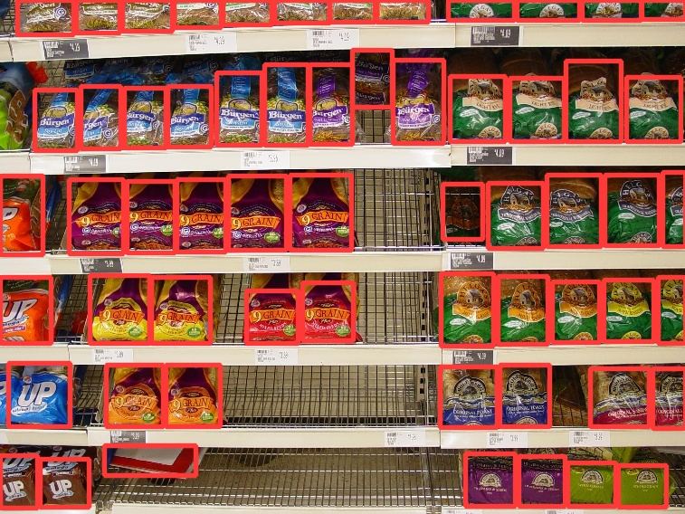

## Shelf Auditing in Retail
This repository contains an application to detect items present in a retail store shelf. This application can be used to keep track of inventory of items simply using images of the items on shelf.

